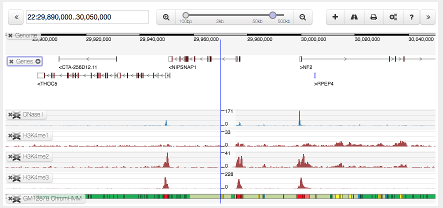

# Biodalliance and Bootstrap 4.1

I'm currently attempting to include Biodalliance inside a site that is using
Bootstrap 4.1. However, this seems to be giving me an issue with the button
toolbar, especially with items that use the `pull-right` class.

Whereas normally Biodalliance's buttons would look something like this (in
terms of their relative horizontal positions):

I'm finding that having Bootstrap 4.1 included causes this to happen:

It's not fully clear to me what the issue is right now. While Bootstrap has
dropped the `pull-right` class (providing `float-right` instead, as I
recall), I would have thought that Biodalliance's use of a "scoped"
Bootstrap stylesheet would solve this issue.

Any help or suggestions on how to overcome this would be most welcome.
